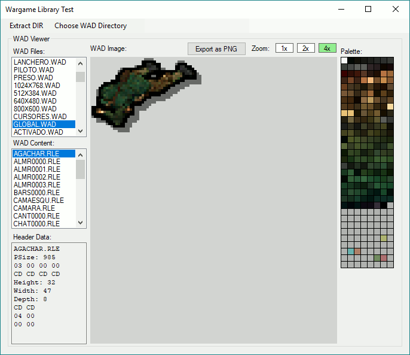

# WargameLib
Modding Library for the Commandos Games

This is a free library that lets you access the texture archives 
(WAD) of the Commandos games. 
Currently it is only tested for 'Behind Enemy Lines'.

The reason why I started this library is the poor performance 
of the GoG release. While the original disk release runs too 
fast, the GoG version runs very laggy and too slow on some 
'older' PCs (I'm talking Dual Core 3.1 GHz).

The goal of this project is to replace the original exe file 
completely so we can actually enjoy the game instead of waiting 
for it to load. This will probably never happen, but you should 
be allowed to have dreams ;-)

Currently working:
- Extract DIR files
- Display contents of WAD files and export as PNG

Next step:
- View Levels

Status: Project is on hold until I finished my other project on github.

